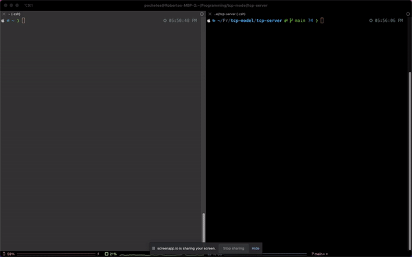
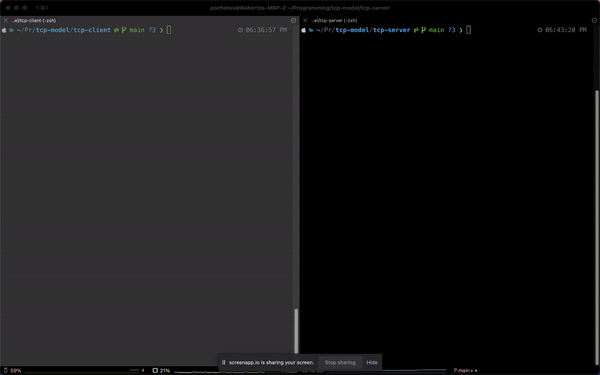

# Low Level TCP Server

This is a TCP server that echos the client's messages back. This was built using C++.

## How does it work?

* First, a socket connection is established with the `socket()` that takes an `int domain`, `int type`, and `int protocol`.
* A socket address of type `sockaddr_in` is binded to the socket created.
* The `sockaddr` structure is then converted to a pair of host name and service strings with `getnameinfo()`.
* A buffer is used to receive the bytes and display them to STDOUT.

## Proof of Concept
To run the server, use `git clone` to use this project and `cd tcp-server`. Use `make` to compile the program and run the executable like so:

```
./server
```

The `telnet` command is then used to communicate with the server, like so:

```
telnet localhost <PORT> 
```
And now you can echo the client's messages back!



### Using the Client Interface

Alternatively, you can build the same version of `telnet` to connect to the server.

To run the client, `cd tcp-client`. Use `make` to compile the program and run the executable like so:

```
./client
```

A command line interface will pop up asking the user to provide a message to send to the server. The following is demonstrated like so:



